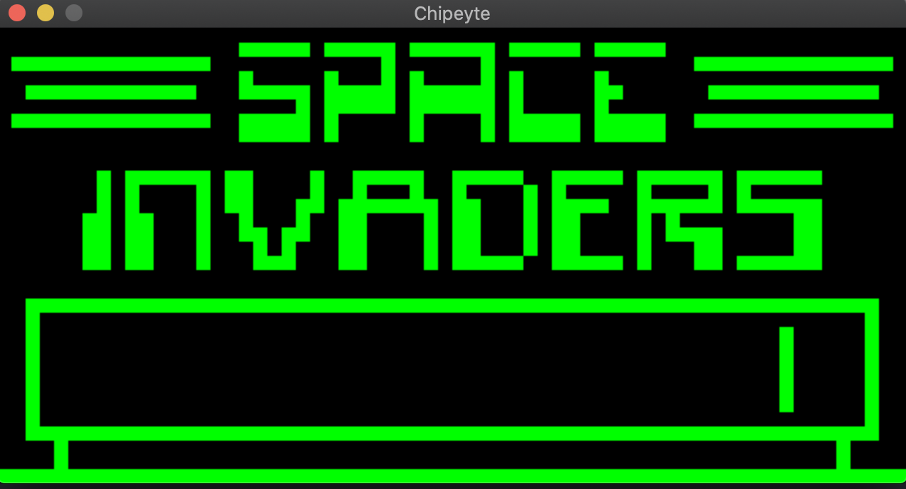

# Chipeyte - a Chip-8 emulator

A Rust implementation of the Chip-8 emulator.



## Running the emulator

**Requirements**

- [Rust](https://www.rust-lang.org/)
- [SDL 2](https://www.libsdl.org/download-2.0.php) for UI

**Instructions**

1. Clone this repository.
2. Build the executable by running `$ cargo build --release --features "sdl2_ui"` in the project root directory.
3. Find some game ROMs, I recommend [Zophar Domain's Chip-8 Games Pack](https://www.zophar.net/pdroms/chip8/chip-8-games-pack.html)
4. In the project root directory, run `$ ./target/release/chipeyte path/to/the/game`

### Controls

Original Chip-8 keyboard had 16 buttons with the following layout:

``` asciidoc
,---------------.
| 1 | 2 | 3 | C |
|---|---|---|---|
| 4 | 5 | 6 | D |
|---|---|---|---|
| 7 | 8 | 9 | E |
|---|---|---|---|
| A | 0 | B | F |
`---------------´
```

In Chipeyte, this has been keyboard layout translated into:

``` asciidoc
,---------------.
| 6 | 7 | 8 | 9 |
|---|---|---|---|
| Y | U | I | O |
|---|---|---|---|
| H | J | K | L |
|---|---|---|---|
| N | M | , | . |
`---------------´
```

## Motivations

The purpose of this project is to learn the lower-level workings of a simple computer as well as basic systems programming in Rust.

The goal is to implement a working Chip-8 simulation not looking at any implementation examples, but solely through reading documentation about the workings of the Chip-8 language.

### References and sources

[How to write an emulator](http://www.emulation.org/EMUL8/HOWTO.html)

[Cowgod's Chip-8 reference](http://devernay.free.fr/hacks/chip8/C8TECH10.HTM)

<http://mattmik.com/files/chip8/mastering/chip8.html>

[Chip-8 manual](https://storage.googleapis.com/wzukusers/user-34724694/documents/5c83d6a5aec8eZ0cT194/CHIP-8%20Classic%20Manual%20Rev%201.3.pdf)

[Wikipedia: CPU](https://en.wikipedia.org/wiki/Central_processing_unit)
